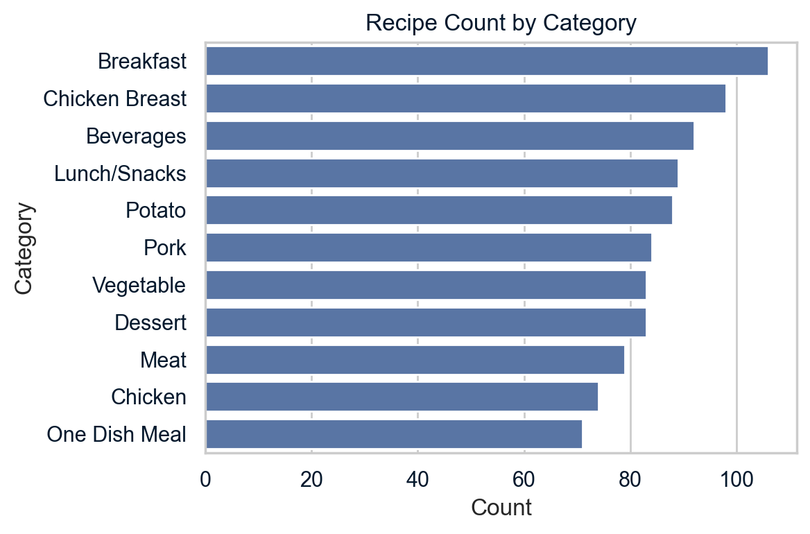

# 🍽️ Predicting Recipe Site Traffic with Machine Learning

This project was submitted as part of a **Data Scientist Professional Practical Exam**. It demonstrates end-to-end data science workflow from data cleaning to business insight generation.

---

## 📌 Problem Statement

**Objective**: Predict whether a recipe will result in **high web traffic** using nutritional and categorical information.

---

## 🧹 Data Validation & Cleaning

| Column        | Issue Identified | Cleaning Action         |
|---------------|------------------|--------------------------|
| `calories`, `sugar`, `protein`, etc. | 52 missing values | Imputed with median |
| `servings`    | Incorrect type    | Converted to numeric     |
| `high_traffic`| Many missing      | Converted to binary flag |

---

## 📊 Exploratory Data Analysis (EDA)

- **Calories** were right-skewed; most under 400.
- **Most frequent categories**: Beverages, Breakfast, Chicken Breast.
- **Calorie level was positively associated** with high traffic.

---

## 🤖 Model Development

**Models Used**:
- `Logistic Regression` (Baseline)
- `Random Forest Classifier`

**Preprocessing**:
- Median imputation (numeric)
- One-Hot Encoding (category)

---

## 📈 Model Performance

| Model             | Accuracy | ROC-AUC |
|------------------|----------|---------|
| LogisticRegression | **77.4%** | **0.867** |
| RandomForest       | 73.7%    | 0.830   |

---

## 📌 Business Recommendation

- High-traffic recipes are associated with **higher calorie content** and **popular categories** (Breakfast, Beverages).
- Business can use these signals to **optimize recipe promotions**.

---

## 📎 Tools Used

`Python` | `pandas` | `matplotlib` | `seaborn` | `scikit-learn` | `Pipeline` | `LogisticRegression` | `RandomForest`

---

## ✅ Conclusion

Logistic Regression provided the best balance of accuracy and simplicity. Results suggest a strong link between recipe content and user engagement — opening doors for content strategy and SEO improvements.

